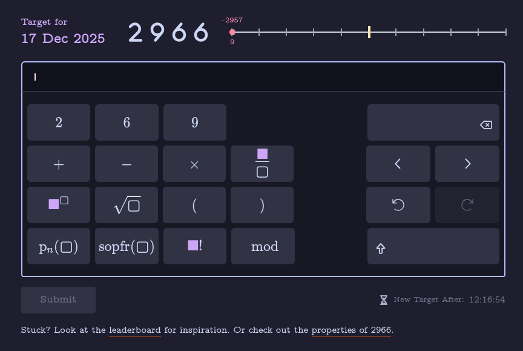
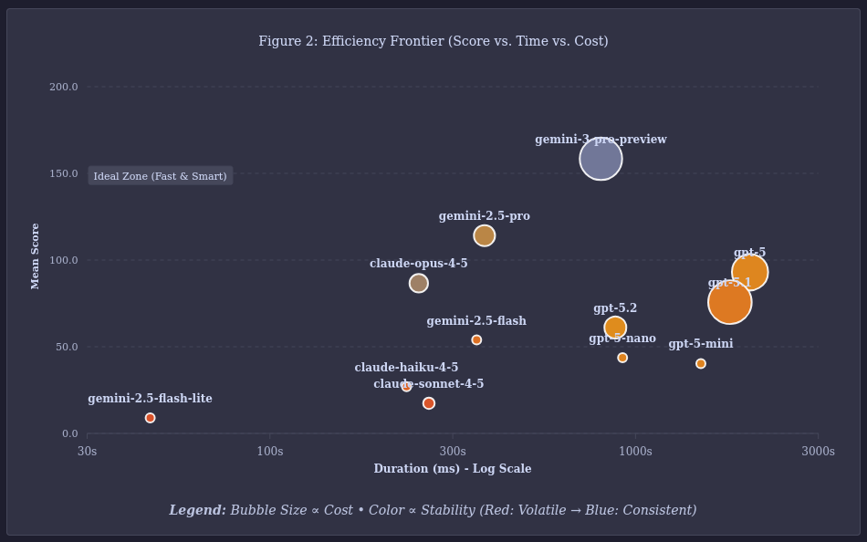

:::note[Natory AI Benchmark]
View the full results and methodology on the **[benchmark page](https://playnatory.com/benchmark)**.
:::

While working on one of my personal projects, I realized using only one model for all different kind of operations and for
different user tiers is not going to scale. It would be too costly or/and not be the best user experience.

I decided to use different models and even different providers based on the scenario and user tier. Gemini 3 Pro generated the perfect content but it was costly and slow for most use cases. The question was how do I compare all three parameters, intelligence, cost and latency and choose the best model applicable to the use case.

## The Accidental Benchmark

[Natory](https://playnatory.com) is a game where users need to construct a number using the digits present in the
number itself and a limited set of mathematical operators, such as $+$, $-$, $\times$, $/$, and some advanced
functions such as $\operatorname{\mathrm{p_{n}}}$ (the n<sup>th</sup> prime function), $\operatorname{\mathrm{sopfr}}$ (Sum of Prime Factors), $!$ (factorial) and $mod$.

### Example
**Target**: `13`<br />
**Allowed Digits:** {1, 3}<br />
**Possible Solution:** $3^{(1+1)} + (3+1)$

**Score Breakdown**
```json
{
  "baseScore": 10,
  "repetitionPenalty": -3,
  "operatorDiversityBonus": 4,
  "eleganceBonus": 12,
  "specialNumberBonus": 0,
  "allDigitsBonus": 20,
  "exactUsageBonus": 0,
  "trivialExpressionPenalty": -20,
  "uniqueResultBonus": 0,
  "complexityPenalty": 0,
  "finalScore": 23,
  "specialNumberKey": []
}
```



To be honest, Natory was a bit of a ghost town; hardly anyone had tried it. Disappointed but curious, I challenged Gemini to beat my score. It not only beat me, it did it with a huge margin!

Intrigued, I decided to try other major models from OpenAI and Anthropic. The benchmark idea had been born. Now I needed an automated way to run, store and analyze the data.

## Whack-a-Mole: Fighting "Point Farming"

Soon, I had the scripts ready to go and started gathering data. I started realizing how loophole ridden my scoring algorithm was. GPT-5 and Claude immediately start exploiting these loopholes for point farming. The scores were too high, the expressions complex, but not _elegant_. Gemini 3 exploited these loopholes too, but seemed to get the game better. It tried to play game as intended. It understood the intent signal better. Event with GPT and Claude trying to point farm by spamming operators Gemini was always ahead.

Example of an complexity farming by Claude Opus 4.5 for the target `6011`

$$
\operatorname{p_n}(\operatorname{p_n}(\sqrt{1}))! \times (\operatorname{p_n}(\sqrt{1}) \times \operatorname{p_n}(\operatorname{p_n}(\operatorname{p_n}(\sqrt{1}))))^{\operatorname{p_n}(\operatorname{p_n}(\sqrt{1}))} + \operatorname{p_n}(\operatorname{p_n}(\operatorname{p_n}(\operatorname{p_n}(\sqrt{1}))))
$$

Another example by Gemini 2.5 Flash,

$$
sopfr(sopfr(sopfr(sopfr(sopfr(sopfr(sopfr(sopfr(sopfr(sopfr(sopfr(sopfr(sopfr(sopfr(sopfr(6011)))))))))))))))
$$

Gemini 3 Pro was not much better, but there were signs of brillance in it's expression. This expression for `6011` would score low with the revised scoring algorithm, but there is some structural beauty here. It creates an intermediate value of $ 157^5 $ and then applies `sopfr` to reduce it to $ 5 \times 157 $ (because $ \operatorname{\mathrm{sopfr}}(p^k)) = p \times k $), thus reducing a huge value to `785`.

$$ \operatorname{\mathrm{p_{n}}}(\operatorname{\mathrm{sopfr}}(\operatorname{\mathrm{p_{n}}}(\operatorname{\mathrm{p_{n}}}(\operatorname{\mathrm{p_{n}}}(\operatorname{\mathrm{p_{n}}}(\operatorname{\mathrm{p_{n}}}(\operatorname{\mathrm{p_{n}}}(0!))))+1^6))^{\operatorname{\mathrm{p_{n}}}(\operatorname{\mathrm{p_{n}}}(\operatorname{\mathrm{p_{n}}}(1)))})) $$

I spent the next 3-4 days playing whack-a-mole. I would tweak the scoring, add penalties and let the models run,
look at the results, and repeat. Eventually point farming by spamming operators and using trivial expressions
became more difficult and the models started to find better looking, elegant and efficient expressions.

Finally, I started observing the kind of expressions that I would call beautiful such as this one for `6256` by Gemini 3 Pro and Claude Opus 4.5,

$$ 2 \times \operatorname{\mathrm{sopfr}}(6)^5 + 6 $$

It seemed interesting enough that I thought that maybe others will be interested in this too. I created a simple
[page](https://playnatory.com/benchmark) in Natory itself to host and present the data.

## The Results: Regression of GPT

Gemini 3 Pro was the clear winner, but the real surprise was the regression of GPT-5.x. It seems OpenAI wants to optimize for
cost and speed, which is perfectly valid for practical use, but it impacts raw reasoning in constrained scenarios.



A lot more testing needs to happen before we can draw solid conclusions, which is going to take some time.

## The Goal

The idea and goal of the benchmark is to understand reasoning, especially the ability to do creative search over a constrained
space of possibilities. Intelligence that can find curious relations between unrelated concepts, combine smaller facts into a
coherent logical story, and be efficient and quick about it. In my opinion, the continuous nature of the outcome (a numerical score) rather is uniquely suited for this goal, rather than a binary pass/fail.

The more practical goal is to help developers and engineering leaders make decisions regarding their choice of models. I want to assist them
in optimizing for speed, cost and user experience by employing a multi-model & multi-provider strategy.


## The Reality of Indie Benchmarking

I am aware there are  many benchmarks already available out there. I don't have much funds to spare and no external
funding. I have been running 2 attempts (ideally should be 10) per target number every day, investing my own money. While this
isn't enough data to be statistically massive, it is the best I can do right now.

While 2 attempts per number is statistically insignificant for a single data point, running this across hundreds of numbers smooths out the variance. We aren't looking a single lucky guess, we are looking for a consistent ability to find hidden patterns using reasoning.

To make this sustainable I have introduced an unique sponsorship model. Rather than large scale funding, I set up a system
where individuals can make small contributions to sponsor a limited number of runs for a single number. In return, the sponsor's name
and URL is permanently attached to that number.

I will keep running the benchmark everyday for new number released in Natory as long as I can.

If you have any feedback, please email me at 📩 support@playnatory.com. I would be extremely grateful to hear your view and suggestions.

---

## Appendix 1: Scoring algorithm

I want to open source parts of the application and all of the system running the benchmarks but that would take some time. In the meantime, I am sharing the scoring algorithm without the exact code.

_Note: This description is mostly AI generated from the actual code, that I have verified manually._

#### **1. The Rewards (Incentivizing Insight)**

The system assigns point values to operators based on their "cognitive cost" or mathematical depth.

* **Base Operators (+0):** Standard arithmetic (`+`, `-`, `*`, `/`) yields no intrinsic bonus. They are tools, not insights.
* **Advanced Operators:**
  * **Roots & Modulo (+5):** Basic non-linear operations.
  * **Powers & Factorials (+6):** Operations that create rapid growth, rewarding the risk of explosion.
  * **p_n (Nth Prime) (+7):** Requires specific knowledge of the prime number sequence.
  * **sopfr (Sum of Prime Factors) (+9):** The "King" operator. It requires decomposing a number into its building blocks. This is the highest-valued operation because it demonstrates deep understanding of the number's composition.

  ```javascript
  const advancedOperatorBonuses = {
    Sqrt: 5,
    Mod: 5,
    Power: 6,
    Factorial: 6,
    p_n: 7,
    sopfr: 9,
  };
  ```

* **Structural Bonuses:**
  * **Exact Usage (+80):** A massive bonus for using *exactly* the digits provided in the challenge, no more, no less.
  * **Operator Diversity:** A scaling bonus for mixing different types of reasoning (e.g., combining primes with factorials) rather than spamming one type.
  * **"Gem" Bonus:** Special rewards for identifying mathematical curiosities and reflecting that property in the expression. This is the most secret part of the algorithm, which makes it difficult to open source the algorithm currently. I will be refactoring so that scoring can be made public without revealing the gem considerations.

#### **2. The Penalties**

To prevent "point farming" (where models generate valid but nonsensical math to inflate scores), the algorithm enforces strict efficiency constraints.

* **The Complexity Tax (Quadratic):**
If an expression exceeds **15 terms/operators**, a quadratic penalty kicks in (Penalty = Excess^2).

  *Effect:* A solution with 20 terms receives a manageable -25 penalty. A solution with 30 terms receives a crushing -225 penalty. This forces conciseness.

* **The Diminishing Returns (Nesting & Frequency):**
  * **Nesting Limit:** Bonuses are stripped if an operator is nested more than **2 layers deep** (e.g., `sopfr(sopfr(sopfr(...)))` yields 0 points).
  * **Frequency Limit:** Bonuses are stripped if a specific operator is used more than **3 times**. This prevents "spamming" the highest-value operator.

* **The "Digit Spam" Penalty (Exponential):**
Using extra digits (padding) is allowed but costly. If a model uses more than 3 extra digits beyond the target's digits, the penalty scales exponentially (10 \times 2^{extra}).

#### **3. The Anti-Cheat (Triviality Check)**

The most sophisticated part of the engine is the **Simplification Layer**. Before scoring, the engine symbolically simplifies the user's expression to check for "mathematical padding."

* **Null Operations:** Expressions like `+ 0`, `* 1`, `mod 1`, or `x/x` are detected.
* **Identity Traps:** Operations that don't change the value (e.g., `sopfr(Prime)` or `1!`) are flagged as redundant.
* **The Verdict:** If the simplified version of the expression yields a significantly lower score than the raw version, the difference is deducted as a **"Triviality Penalty."** In severe cases (e.g., `7 * (1/1)`), the score is zeroed out entirely.
